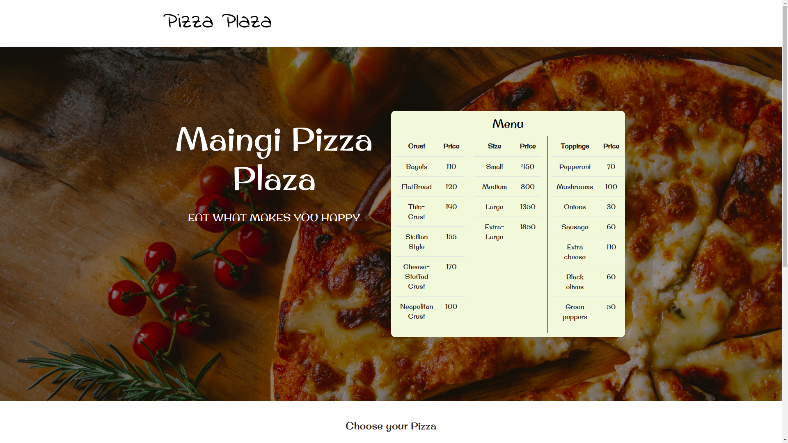
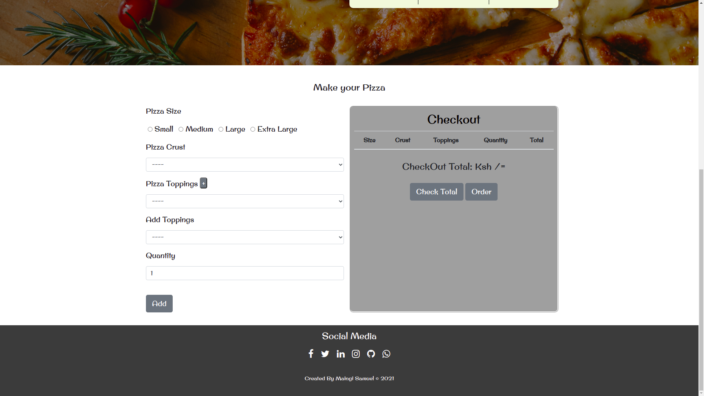

# Maingi Pizza Plaza

#### Created on 23th April 2021
#### By Samuel Maingi Mutunga

## Description 
Developed and Designed a website for my own Pizza Place, For a way to widen my Customer Base, My Website has a place where the Customers order different Sizes of the Pizzas with One or more toppings.

Landing Section

Ordering Section

---

## Access the website
Need the latest browser to be able to View

Follow this link --> https://layersony.github.io/Maingi_pizza_plaza/

It is hosted by github.

---

### Setup
To access this project on your local files, you can clone it using these steps
1. Open your terminal
1. Use this command to clone `$ git clone https://github.com/layersony/Maingi_pizza_plaza.git`
1. This will clone the repositoty into your local folder
1. Run `index.html` with active internet
1. __Enjoy :)__

---

## Behaviour Driven Development

1. Display an Error Message if Pizza Size is not Choosen
   - INPUT: User selects type of pizza they want
   - OUTPUT: Diplays in Checkout section
2. Displays an Error Message if Pizza Crust input Left Blank
   - INPUT: ""
   - OUTPUT: Choose Pizza Crust
3. Displays an Error Message if Pizza Topping input is Left Blank
   - INPUT: ""
   - OUTPUT: Choose Pizza Toppings
3. Displays an Error Message if Pizza Quantity input is Left Blank
   - INPUT: ""
   - OUTPUT: Value Should be greater than 1, Quanity Ranges from 1 to 100
7. Add Toppings
   - INPUT: Click + Button
   - OUTPUT: New Input appears for User to Select
4. Check Total Button on Click
   - INPUT: Click Check Total Button
   - OUTPUT: Computes Total Cost of all pizza and Outputs Total
5. Order Button on Click
   - INPUT: Click Order Button
   - OUTPUT: Delivery or Collection Section Displayed
6. User Select Collect
   - INPUT: Select Collect
   - OUTPUT: Collect Within an 1 hour
7. User Select Delivery
   - INPUT: Enter Location
   - OUTPUT: Location Recorded, Delivery fee is 150ksh

---

## Known Bugs

* Sometimes the Order Button fails to Function, One Needs to Load the Website Again
* Delivery Prompt Tends to Repeat Itself  a couple of Times before Closing
* Site not 100% Responsive due to the Checkout Table for Screens with a max-width of 370px

## Technologies Used
HTML

CSS

JAVASCRIPT

jQuery

BOOTSTRAP

Git

---

## Contact Details
sammaingi5@gmail.com

@Maingi `Slack Moringa`

Can View My Portfolio --> [Click_ME](https://layersony.github.io/portfolio/)

---

### License
This Project is under the [MIT](LICENCE) license